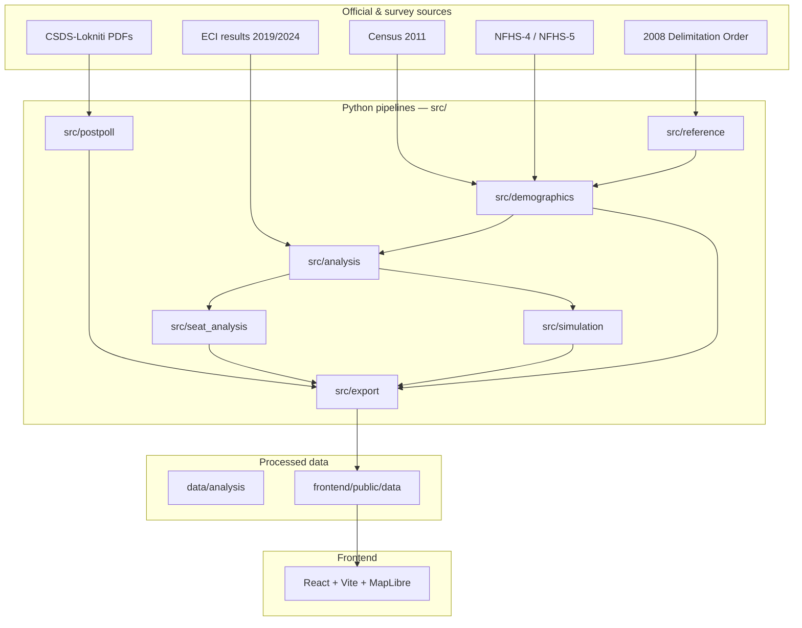

# The 543

**Indian Election Intelligence** — explore Lok Sabha elections, demographics, swings, and survey behavior at constituency level.

**Live site:** [the543.org](https://the543.org)

The 543 is a research-grade data platform that joins official election results (2019 & 2024), NFHS/Census demographics, 2008 delimitation crosswalks, and CSDS-Lokniti survey tables into a single constituency spine. A static React dashboard reads pre-built JSON bundles; Python pipelines handle ingestion, cleaning, validation, and export.

---

## What you can do

| Capability | Status |
|------------|--------|
| Explore 542 contested Lok Sabha seats on an interactive map | Live |
| Compare 2019 vs 2024 national and state swings | Live |
| View constituency profiles (results, demographics, coverage flags) | Live |
| Insights Lab — exploratory vote-share vs demographic correlations | Live |
| Seat intelligence notes (generated + manual analyst overrides) | Live |
| CSDS pre-poll / post-poll vote-bank tables (curated subset) | Live |
| Forecast Lab — browser Monte Carlo scenario tool | Experimental |
| FastAPI backend with district/constituency API + simple simulation | Optional dev tool |

---

## Architecture



**Design principle:** the dashboard never hardcodes statistics. Every number shown in production comes from a traced CSV/JSON artifact with explicit coverage and quality labels. Missing data stays missing — the UI surfaces gaps instead of imputing values.

---

## Repository layout

```
Election-simulator/
├── frontend/                 # React dashboard (deployed to Vercel)
│   ├── public/data/          # Static JSON consumed by the app
│   └── public/geo/           # India states, districts, constituencies GeoJSON
├── backend/                  # Optional FastAPI + SQLAlchemy API
├── data/
│   ├── database/             # ECI constituency & results tables
│   ├── reference/            # Delimitation crosswalks, party alliances
│   ├── demographics/         # Census, NFHS, manual overrides, census autofill
│   ├── analysis/             # Constituency election + demographic master
│   ├── postpoll/             # CSDS extraction & curated vote-behavior tables
│   ├── seat_analysis/        # Generated & manual seat notes
│   └── behaviour-analysis/   # Raw CSDS PDFs (not in git — place locally)
├── src/
│   ├── reference/            # Delimitation PDF → LS/AC/district crosswalks
│   ├── demographics/         # Census/NFHS cleaners, panels, manual layer
│   ├── analysis/             # Master table, correlations, coverage audits
│   ├── postpoll/             # CSDS PDF table extraction & taxonomy QA
│   ├── seat_analysis/        # Seat notes & research packets
│   ├── simulation/           # Deterministic + Monte Carlo JSON bases
│   └── export/               # build_frontend_data_bundle.py
├── scripts/                  # Deploy safety checks, production helpers
└── requirements.txt          # Root Python dependencies (pipelines)
```

Large raw files (DHS microdata zips, CSDS PDFs, Census uploads) are **not** committed to git. Processed outputs under `data/` and `frontend/public/data/` are checked in for reproducible builds.

---

## Quick start

### 1. Clone and set up Python

```bash
git clone <repo-url>
cd Election-simulator

python -m venv venv
source venv/bin/activate        # Windows: venv\Scripts\activate
pip install -r requirements.txt
```

### 2. Build the frontend data bundle

```bash
python -m src.export.build_frontend_data_bundle
python scripts/check_deploy_safety.py
```

### 3. Run the dashboard locally

```bash
cd frontend
npm install
npm run dev
```

Open **http://127.0.0.1:5173**

### 4. (Optional) Run the backend API

```bash
pip install -r backend/requirements.txt
python backend/scripts/load_csvs_to_postgres.py   # SQLite by default
uvicorn backend.app.main:app --reload
```

API docs: **http://127.0.0.1:8000/docs** — see [backend/README.md](backend/README.md).

---

## Data spine

The platform's core dataset is one row per **contested Lok Sabha constituency** (542 seats in the 2024 election master), keyed by normalized `state_key` and `constituency_key`.

| Layer | Primary file | Description |
|-------|--------------|-------------|
| Election results | `data/database/results_table_{2019,2024}.csv` | ECI-style constituency results |
| Delimitation | `data/reference/lok_sabha_district_summary_delimitation.csv` | LS seat → district segment shares |
| NFHS panel | `data/demographics/processed/constituency_demographic_panel.csv` | Weighted district→constituency NFHS features |
| Manual overrides | `data/demographics/manual/manual_constituency_demographics.csv` | Source-tracked gap fills |
| Master join | `data/analysis/constituency_election_demographic_master_with_manual.csv` | Election + demographics + coverage |
| Frontend export | `frontend/public/data/constituencies.json` | Deployable constituency records |

**Seat universe:** `finalize_543_seat_universe` defines the canonical 542-seat platform universe. Old PC names, alias duplicates, and geo-only extras are listed in `data/demographics/manual/reports/non_543_records_to_exclude.csv`. Surat (Gujarat) is flagged as a 2024 uncontested seat present in GeoJSON but absent from the election master.

---

## Pipeline modules

Each module has its own README with commands, inputs, and outputs.

| Module | README | Responsibility |
|--------|--------|----------------|
| Reference / delimitation | [src/reference/README.md](src/reference/README.md) | Parse 2008 Delimitation Order; LS→AC→district crosswalks; Census district aliases |
| Demographics warehouse | [src/demographics/README.md](src/demographics/README.md) | Census 2011 cleaners, NFHS/DHS ingestion, district master, constituency panel |
| NFHS constituency panel | [src/demographics/nfhs/README.md](src/demographics/nfhs/README.md) | NFHS-4/5 district features → constituency-weighted panel |
| DHS / NFHS microdata | [src/demographics/dhs/README.md](src/demographics/dhs/README.md) | Zip audit, GE join diagnostics, state/district feature builders |
| Manual demographics | [src/demographics/manual/README.md](src/demographics/manual/README.md) | Source-tracked manual overrides, completion worklist, daily batches |
| Census 2011 autofill | [src/demographics/census/README.md](src/demographics/census/README.md) | District-level Census proxies, C-01 religion downloader, autofill candidates |
| Election analysis | [src/analysis/README.md](src/analysis/README.md) | Master table, swing tables, driver correlations, coverage diagnostics |
| CSDS post-poll | [src/postpoll/README.md](src/postpoll/README.md) | PDF extraction, taxonomy-guided QA, pre/post comparison, poll accuracy |
| Seat intelligence | [src/seat_analysis/README.md](src/seat_analysis/README.md) | Generated seat notes, manual analyst workflow, research packets |
| Simulation bases | [src/simulation/README.md](src/simulation/README.md) | Deterministic + Monte Carlo JSON for Forecast Lab |
| Frontend | [frontend/README.md](frontend/README.md) | Pages, routes, stack, local dev |
| Backend API | [backend/README.md](backend/README.md) | FastAPI endpoints, DB loader, tests |

---

## Common workflows

### Rebuild everything for the dashboard

```bash
# Analysis spine (if upstream data changed)
python -m src.analysis.build_constituency_election_demographic_master
python -m src.analysis.coverage_diagnostics

# Manual demographics (if you edited manual CSV)
python -m src.demographics.manual.validate_manual_demographics
python -m src.demographics.manual.merge_manual_demographics

# Seat notes
python -m src.seat_analysis.build_seat_analysis_baseline
python -m src.seat_analysis.merge_manual_seat_notes

# Simulation JSON (optional)
python -m src.simulation.build_simulation_base
python -m src.simulation.build_monte_carlo_base

# Export + frontend build
python -m src.export.build_frontend_data_bundle
python scripts/check_deploy_safety.py
cd frontend && npm run build
```

### Census religion autofill (district-level C-01)

```bash
python -m src.demographics.census.finalize_543_seat_universe
python -m src.demographics.census.download_c01_religion_files
python -m src.demographics.census.build_census_religion_district
python -m src.demographics.census.autofill_constituency_core_demographics
```

Review candidates in `data/demographics/manual/manual_constituency_demographics_autofill_candidates.csv` before merging. **Autofill never writes to the manual CSV automatically.**

### CSDS vote-behavior extraction

```bash
# Place PDFs under data/behaviour-analysis/{pre-poll,post-poll}/{2019,2024}/
python -m src.postpoll.improve_taxonomy_extraction
python -m src.postpoll.approve_taxonomy_candidates
python -m src.export.build_frontend_data_bundle
```

Open `data/postpoll/manual/review_pages/taxonomy_review_index.html` for human QA. Only **curated** taxonomy-approved rows reach the dashboard.

---

## Frontend pages

| Route | Page |
|-------|------|
| `/` | Explore — India map, search, constituency side panel |
| `/compare` | 2019 vs 2024 national comparison |
| `/insights` | Insights Lab — correlation explorer |
| `/methodology` | Data sources, coverage, limitations |
| `/state/:stateKey` | State overview |
| `/constituency/:stateKey/:constituencyKey` | Full constituency profile |
| `/forecast` | Forecast Lab (experimental Monte Carlo) |

**Stack:** React 18, TypeScript, Vite, Tailwind CSS, MapLibre GL, Recharts, TanStack Query.

---

## Deployment

Production is a **static Vite build** on Vercel (`frontend/` as root directory).

```bash
python -m src.export.build_frontend_data_bundle
python scripts/check_deploy_safety.py
cd frontend && npm run build
```

Full Vercel + custom domain setup: [frontend/DEPLOYMENT.md](frontend/DEPLOYMENT.md).

---

## Data integrity rules

These rules apply across every pipeline in this repository:

1. **No invented values** — election results, demographics, and survey shares must trace to a source file, page, or table cell.
2. **No silent imputation** — missing fields stay blank; coverage flags explain why.
3. **Generated NFHS estimates are preferred** over manual entries unless `override_allowed=true`.
4. **District proxies are not constituency microdata** — Census autofill uses population-weighted district estimates; confidence and method are recorded per field.
5. **CSDS pre-to-post shifts are descriptive**, not labeled as "polling error" or causal effects.
6. **Delimitation segment shares are not GIS weights** — they count assembly segments per district, not population or polygon overlap.
7. **Verify against official publications** — ECI results and Census/NFHS figures should be cross-checked before citing in research.

---

## What is not in git

Place these locally after cloning:

| Asset | Suggested location |
|-------|-------------------|
| Census 2011 raw tables | `data/demographics/census/raw/` or `data/raw/demographics-census-2011/` |
| NFHS/DHS microdata zips | `data/raw/dhs_downloads/` |
| CSDS-Lokniti PDFs | `data/behaviour-analysis/post-poll/` and `pre-poll/` |
| 2008 Delimitation PDF | `data/raw/ls-as-mapping/` |

The pipelines detect files in legacy paths where noted in module READMEs.

---

## Requirements

| Component | Version |
|-----------|---------|
| Python | 3.12+ recommended (3.11+ for backend) |
| Node.js | 18+ |
| PostgreSQL | Optional (SQLite default for backend dev) |
| Poppler (`pdftotext`) | Required for delimitation PDF extraction |

---

## License & use

Research and educational use. Election figures should be verified against official Election Commission of India publications. Demographic and survey data carry their own source licenses (Census of India, NFHS/DHS, CSDS-Lokniti).

---

## Further reading

- [frontend/README.md](frontend/README.md) — local dev, pages, stack
- [frontend/DEPLOYMENT.md](frontend/DEPLOYMENT.md) — Vercel production deploy
- [src/demographics/census/README.md](src/demographics/census/README.md) — Census autofill & C-01 downloader
- [src/demographics/manual/README.md](src/demographics/manual/README.md) — manual demographic workflow
- [src/postpoll/README.md](src/postpoll/README.md) — CSDS extraction & taxonomy QA
